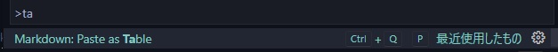
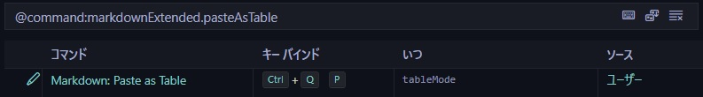

# vscode MD plugin 検証

- ## [拡張機能 4 種](#拡張機能-4種)
  - ### [Markdown All in One](#markdown-all-in-one)
  - ### [Markdown PDF](#markdown-pdf)
  - ### [TextTables](#texttables)
  - ### [Markdown Extended](#markdown-extended)
- ## [自環境でエラー](#自環境でエラー)
    - ### [コミットメッセージで繰り返し言葉を手早く打ちたい技術](#コミットメッセージで繰り返し言葉を手早く打ちたい技術)
   

# 拡張機能 4 種

 

## [Markdown All in One](https://marketplace.visualstudio.com/items?itemName=yzhang.markdown-all-in-one)

- [すぐに使えそうな見出し作成 && URL 貼り付け md 形式に変換機能](https://yamaccu.github.io/tils/20210830-MarkDown-AllInOne)
- [すぐに使えそうなショトカ](https://zenn.dev/ctrlkeykoyubi/articles/vscode-markdown-all-in-one#3.1.-%E3%82%AD%E3%83%BC%E3%83%9C%E3%83%BC%E3%83%89%E3%82%B7%E3%83%A7%E3%83%BC%E3%83%88%E3%82%AB%E3%83%83%E3%83%88)
   

## [Markdown PDF](https://github.com/yzane/vscode-markdowfn-pdf)

- pdf etc..に変換するプラグイン。MarkdownExtended だけでも同じように生成出来る。
   

## [TextTables](https://marketplace.visualstudio.com/items?itemName=RomanPeshkov.vscode-text-tables)

- [ctrl + q × 2 で普通に excel 操作する感覚で table を markdown 形式で生成してくれるモードに切り替わる](https://forest.watch.impress.co.jp/docs/review/1154742.html)
  - 初期だとキーバインド 3 つしかない為コマンドパレットいちいち打たないとダメ
    - 初期のフォーマットキーバインドは ctrl+f と競合するときがあるので変更した
  - [keybinding.json を設定しよう](./.vscode/keybindings.json)
    - tab shift+tab でのセル移動は必須。テーブル作成は後述するスニペットでもよき

## [Markdown Extended](https://github.com/qjebbs/vscode-markdown-extended)

- pdf etc.. の変換の設定
  - vscode の setting 又は [md ファイルに直接書く](https://github.com/qjebbs/vscode-markdown-extended#export-configurations)
- [helpers](https://github.com/qjebbs/vscode-markdown-extended#export-configurations)

  - 現在キー設定は消されている(alt+↑ alt+↓ のみ)
  - [md の snippets 設定は初期で無効な為追記する](https://worklifefun.net/vscode-markdown-snippet/)

    - [設定方法](https://qiita.com/282Haniwa/items/82828c6a566e3e7e047d)
    - [よく使うテンプレートがあるなら記述する](./.vscode/markdown.json)
    - [初期 Snippets prefix 打って](https://github.com/qjebbs/vscode-markdown-extended#snippets)

      
snippets一覧

      | Prefix          | Context                          | View                    |
      | --------------- | -------------------------------- | ----------------------- |
      | underline       | _under_ line                     | under line              |
      | mark            | ==mark==                         | ==mark==                |
      | subscript       | ~sub~script                      | subscript               |
      | superscript     | ^super^script                    | ^super^script           |
      | checkbox        | [] checkbox                      | [ ] checkbox            |
      | tasklist        | - [] task                        | [ ] tasklist            |
      | table           | Markdown                         | Table                   |
      | kbd             | <kbd>Keyboard</kbd>              | Keyboard                |
      | admonition note | !!! warn                         | addmonition             |
      |                 | text                             |                         |
      | footnote        | [^abc]                           | footnote                |
      |                 | [^abc]: ABC                      |                         |
      | container       | markdown                         | container               |
      | abbr            | \*[ABBR]: Abbreviation           | abbr                    |
      | attr            | **attr**{style="color:red"}      | attr{style="color:red"} |
      | color           | color red | color red               |

      - 

  - [keybinding 設定でやってみる](./.vscode/keybindings.json)
    - keybind 設定はコマンドパレットからコマンドを検索
    
    
    - 

      
コマンド一覧

        ## tableMode時に有効にしてみる
        ### Table: Paste as Tableを追記した
        | Command                       | Keyboard Shortcut             |
        | ----------------------------- | ----------------------------- |
        | Format: Toggle Bold           | Ctrl+B                        |
        | Format: Toggle Italics        | Ctrl+I                        |
        | Format: Toggle Underline      | Ctrl+U                        |
        | Format: Toggle Mark           | Ctrl+M                        |
        | Format: Toggle Strikethrough  | Alt+S                         |
        | Format: Toggle Code Inline    | Alt+`                         |
        | Format: Toggle Code Block     | Alt+Shift+`                   |
        | Format: Toggle Block Quote    | Ctrl+Shift+Q                  |
        | Format: Toggle Superscript    | Ctrl+Shift+U                  |
        | Format: Toggle Subscript      | Ctrl+Shift+L                  |
        | Format: Toggle Unordered List | Ctrl+L, Ctrl+U                |
        | Format: Toggle Ordered List   | Ctrl+L, Ctrl+O                |
        | Table: Paste as Table         | Ctrl+Shift+T, Ctrl+Shift+P    |
        | Table: Format Table           | Ctrl+Shift+T, Ctrl+Shift+F    |
        | Table: Add Columns to Left    | Ctrl+Shift+T, Ctrl+Shift+L    |
        | Table: Add Columns to Right   | Ctrl+Shift+T, Ctrl+Shift+R    |
        | Table: Add Rows Above         | Ctrl+Shift+T, Ctrl+Shift+A    |
        | Table: Add Row Below          | Ctrl+Shift+T, Ctrl+Shift+B    |
        | Table: Move Columns Left      | Ctrl+Shift+T Ctrl+Shift+Left  |
        | Table: Move Columns Right     | Ctrl+Shift+T Ctrl+Shift+Right |
        | Table: Delete Rows            | Ctrl+Shift+D, Ctrl+Shift+R    |
        | Table: Delete Columns         | Ctrl+Shift+D, Ctrl+Shift+C    |
        

  - paste 機能 太文字、行線などは対応していない。

## 自環境でエラー

- win[wsl ubuntu20.04]
  - MarkdownExetended の paste 機能使用時
  - xsel コマンド+DISPLAY の環境変数設定が必要
  - vscode の環境変数を設定しないとだめ?
- #### 参考サイト
  - [pbcopy](https://devlights.hatenablog.com/entry/2021/05/28/100517)
  - [環境変数の設定](https://qiita.com/7iva/items/9ecd7f2f178cd7c1d0b3)
  - [環境変数(公式)](https://www.digitalocean.com/community/tutorials/how-to-read-and-set-environmental-and-shell-variables-on-linux-ja)

### コミットメッセージで繰り返し言葉を手早く打ちたい技術

- [打ちたい時あるよね？](https://dic.nicovideo.jp/a/%E5%A4%B1%E6%95%97%E3%81%97%E3%81%9F%E5%A4%B1%E6%95%97%E3%81%97%E3%81%9F%E5%A4%B1%E6%95%97%E3%81%97%E3%81%9F%E5%A4%B1%E6%95%97%E3%81%97%E3%81%9F%E5%A4%B1%E6%95%97%E3%81%97%E3%81%9F)
- [GNU-nano で加工](https://dev.classmethod.jp/articles/git-commit-gnu-nano/)
- ctrl+z で job 保存してしまったら fg で再開
- ctrl+o 保存
- ctrl+x コミット
- [GNU-nano 使いこなす](https://qiita.com/snct_hu/items/971d512c26dd8b3a3b3c)
